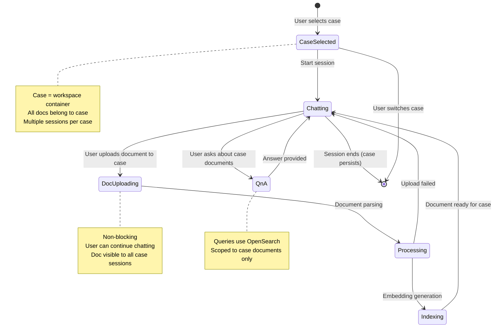
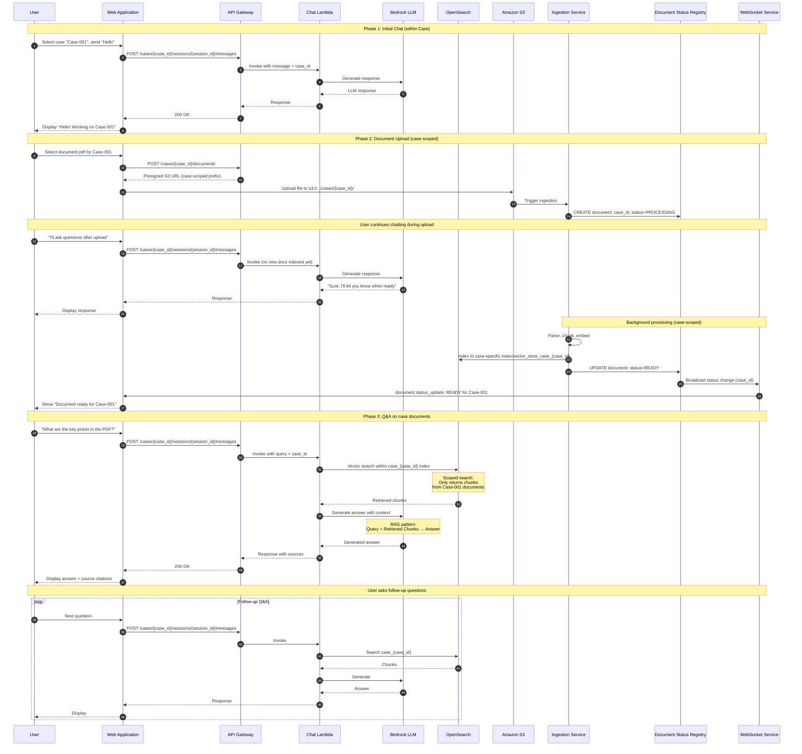

# Chat Session with Document Upload Flow

**Document Version:** 1.0
**Date:** 2026-05-06
**Purpose:** User conversation flow with mid-chat document upload and Q&A within a case context

**Key Concept:** Users work on multiple cases. Documents are case-scoped, not session-scoped.

---

## Table of Contents

1. [Conversation Flow Overview](#1-conversation-flow-overview)
2. [Sequence Diagram](#2-sequence-diagram)
3. [Message Types](#3-message-types)
4. [API Endpoints](#4-api-endpoints)

---

## 1. Conversation Flow Overview

**Hierarchy:** User → Cases → Sessions → Documents



---

## 2. Sequence Diagram



---

## 3. Message Types

### 3.1 Chat Message

**Direction:** User → System

```json
{
    "case_id": "case_abc123",
    "session_id": "sess_def456",
    "message": {
        "role": "user",
        "content": "What are the key points in the PDF?",
        "timestamp": "2026-05-06T10:30:00Z"
    }
}
```

### 3.2 Assistant Response

**Direction:** System → User

```json
{
    "case_id": "case_abc123",
    "session_id": "sess_def456",
    "message": {
        "role": "assistant",
        "content": "Based on the document, the key points are...",
        "sources": [
            {
                "document_id": "doc_xyz789",
                "filename": "policy.pdf",
                "page": 3,
                "chunk_id": "chunk_456",
                "relevance_score": 0.92
            }
        ],
        "timestamp": "2026-05-06T10:30:05Z"
    }
}
```

### 3.3 Document Status Update (WebSocket)

**Direction:** System → User (async)

```json
{
    "type": "document.status_update",
    "case_id": "case_abc123",
    "document": {
        "document_id": "doc_xyz789",
        "filename": "policy.pdf",
        "status": "ready",
        "chunk_count": 42
    }
}
```

**Status Values:**
| Status | Description |
|--------|-------------|
| `uploading` | File being uploaded |
| `processing` | Parse/chunk/embed in progress |
| `ready` | Indexed and ready for queries |
| `error` | Processing failed |

---

## 4. API Endpoints

### 4.1 Send Chat Message

**POST** `/api/v1/cases/{case_id}/sessions/{session_id}/messages`

**Request:**
```json
{
    "content": "What are the key points?",
    "stream": false
}
```

**Response:** `200 OK`
```json
{
    "message_id": "msg_def456",
    "role": "assistant",
    "content": "Based on the uploaded document...",
    "sources": [
        {
            "document_id": "doc_xyz789",
            "filename": "handbook.pdf",
            "page": 5,
            "excerpt": "Employee benefits include..."
        }
    ],
    "created_at": "2026-05-06T10:30:05Z"
}
```

### 4.2 Upload Document to Case

**POST** `/api/v1/cases/{case_id}/documents`

**Request:** `multipart/form-data`
```
file: [binary]
metadata: {"tags": ["policy"]}
```

**Response:** `202 Accepted`
```json
{
    "case_id": "case_abc123",
    "upload_id": "upload_abc123",
    "document_id": "doc_xyz789",
    "status": "processing",
    "estimated_time_seconds": 15
}
```

### 4.3 Get Case Documents

**GET** `/api/v1/cases/{case_id}/documents`

**Response:** `200 OK`
```json
{
    "case_id": "case_abc123",
    "documents": [
        {
            "document_id": "doc_xyz789",
            "filename": "handbook.pdf",
            "status": "ready",
            "uploaded_at": "2026-05-06T10:25:00Z",
            "chunk_count": 42
        }
    ]
}
```

### 4.4 Get Session Messages

**GET** `/api/v1/cases/{case_id}/sessions/{session_id}/messages`

**Response:** `200 OK`
```json
{
    "case_id": "case_abc123",
    "session_id": "sess_def456",
    "messages": [
        {
            "message_id": "msg_abc123",
            "role": "user",
            "content": "Hello",
            "timestamp": "2026-05-06T10:25:00Z"
        },
        {
            "message_id": "msg_def456",
            "role": "assistant",
            "content": "Hello! How can I help?",
            "timestamp": "2026-05-06T10:25:01Z"
        }
    ]
}
```

---

## Key Flow Characteristics

1. **Case-scoped documents**: All documents belong to a case, not a session
2. **Multiple sessions per case**: User can have multiple conversations within same case
3. **Non-blocking upload**: Chat continues during document processing
4. **Async notifications**: WebSocket updates when doc ready (case-scoped)
5. **RAG pattern**: Vector search + LLM generation for Q&A
6. **Scoped search**: Queries only return documents from the same case
7. **Source attribution**: Answers include document citations

---

**END OF DOCUMENT**
