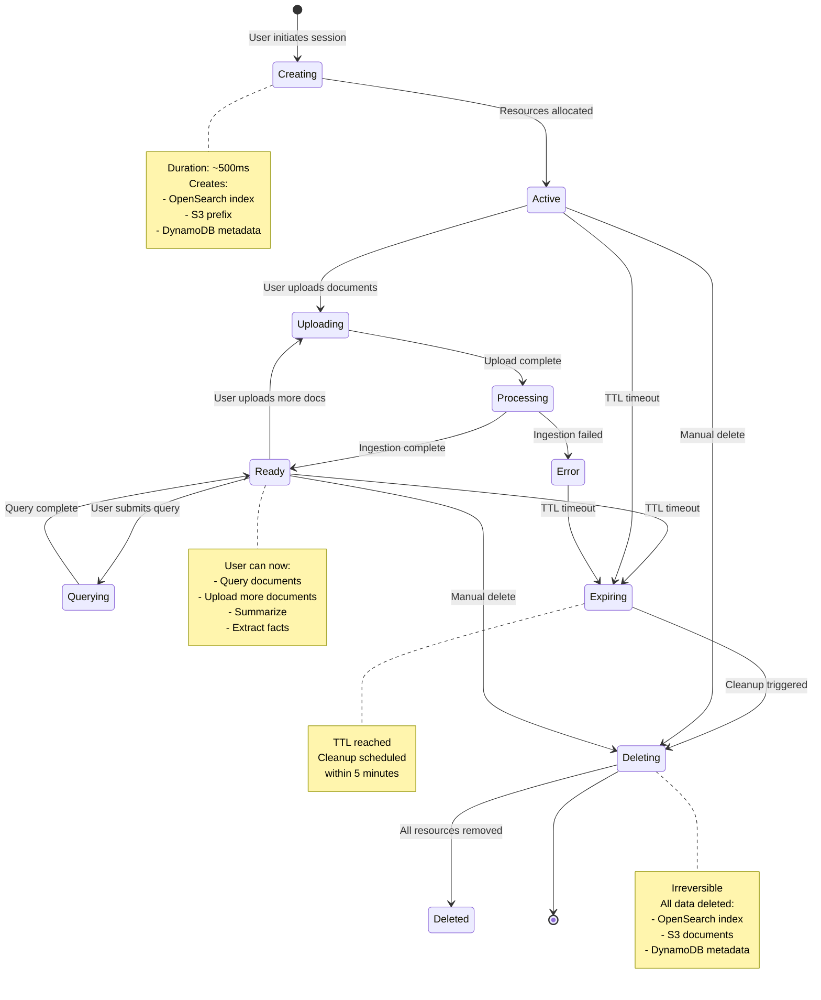
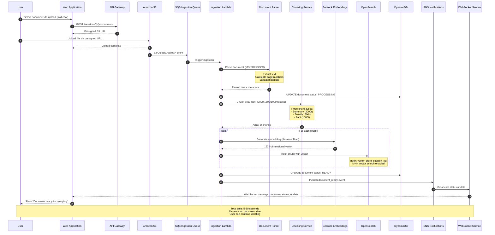
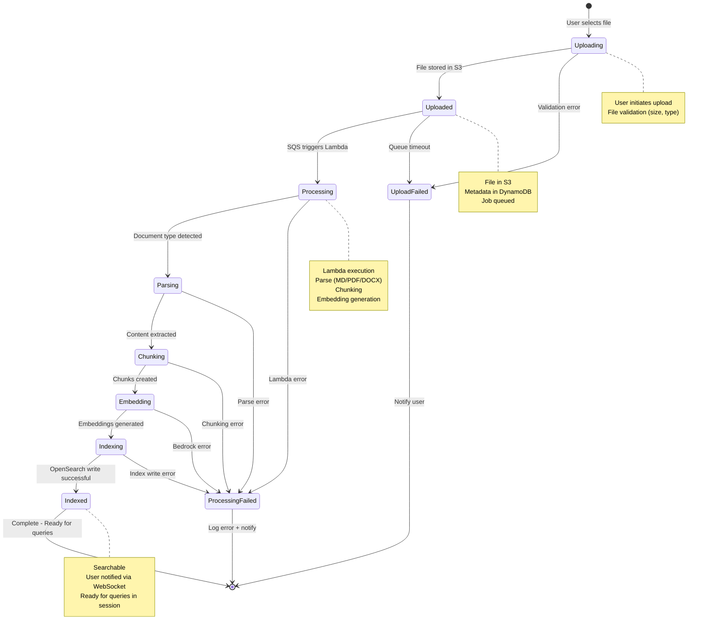

# Document Upload Mid-Chat Session

**Document Version:** 1.0
**Date:** 2026-05-06
**Purpose:** Mermaid diagrams for document upload during active chat session

---

## Table of Contents

1. [Session State Machine](#1-session-state-machine)
2. [Document Upload During Session (Sequence)](#2-document-upload-during-session)
3. [Document Upload Lifecycle](#3-document-upload-lifecycle)
4. [API Endpoints](#4-api-endpoints)

---

## 1. Session State Machine

Shows session states including document upload during active session:



---

## 2. Document Upload During Session

Sequence diagram for uploading documents to an active chat session:



---

## 3. Document Upload Lifecycle

State diagram for individual document upload process:



---

## 4. API Endpoints

### 4.1 Upload Document to Session

**POST** `/api/v1/sessions/{session_id}/documents`

**Request:**
```json
{
    "files": [binary files],
    "metadata": {
        "tags": ["policy", "hr"],
        "description": "Employee handbook 2025"
    }
}
```

**Response:** `202 Accepted`
```json
{
    "upload_id": "upload_abc123",
    "documents": [
        {
            "document_id": "doc_xyz789",
            "filename": "handbook.md",
            "status": "uploaded",
            "estimated_indexing_time": 180
        }
    ]
}
```

### 4.2 Get Document Status

**GET** `/api/v1/sessions/{session_id}/documents/{document_id}`

**Response:** `200 OK`
```json
{
    "document_id": "doc_xyz789",
    "filename": "handbook.md",
    "status": "ready",
    "chunk_count": 42,
    "indexed_at": "2026-05-06T10:30:00Z"
}
```

**Status Values:**
| Status | Description |
|--------|-------------|
| `uploading` | File being uploaded to S3 |
| `uploaded` | File in S3, queued for processing |
| `processing` | Being parsed and chunked |
| `indexed` | Embeddings generated, in OpenSearch |
| `ready` | Ready for queries |
| `error` | Processing failed |

---

## Supported Document Types

| Type | Extensions | Parser |
|------|------------|--------|
| Markdown | `.md` | Direct read |
| PDF | `.pdf` | PyPDF / Textract |
| Word | `.docx` | python-docx |
| Text | `.txt` | Direct read |
| Excel | `.xlsx` | openpyxl |

---

## Key Features

1. **Non-blocking upload**: User can continue chatting while documents process
2. **WebSocket updates**: Real-time status updates to frontend
3. **Session-scoped**: Documents isolated to specific session
4. **Multi-format support**: MD, PDF, DOCX, TXT, XLSX
5. **Status tracking**: Full lifecycle state per document
6. **Error handling**: Graceful failure with user notification

---

**END OF DOCUMENT**
