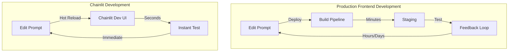
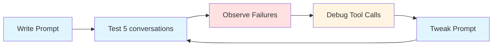
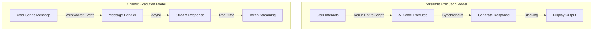
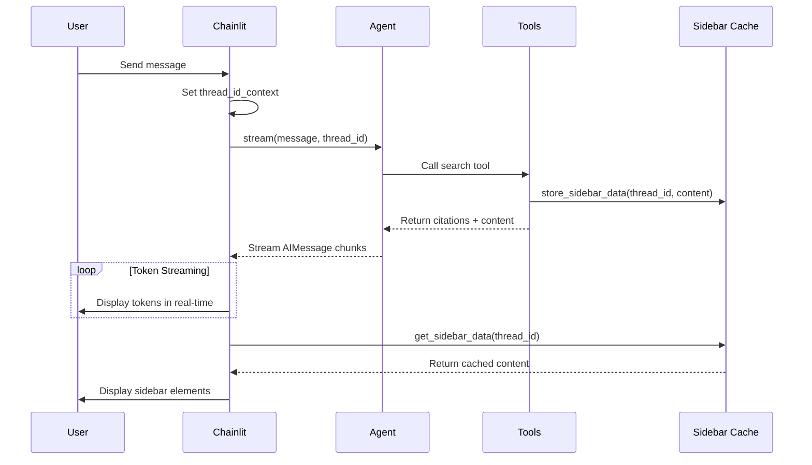
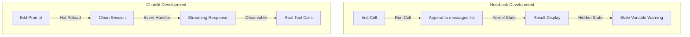

# Why Chainlit for AI Development

**A comprehensive case for using Chainlit as the dedicated AI development environment**

---

## Executive Summary

AI chatbot development requires a different development approach than traditional software. This document explains:

1. **Why AI development must not happen against production frontend** - slow iteration, hidden information, instability
2. **Why AI developers need a dedicated fast iteration tool** - prompt engineering, agent debugging, tool validation
3. **Why Chainlit is better than Streamlit for AI chat development** - execution model, built-in features, tool visualization

---

## Part 1: Why AI Development Must Not Happen on Production

### The Fundamental Mismatch

Traditional software development is deterministic:
- Write code → run tests → ship
- Same input = same output
- Testing = correctness against specs

AI development is probabilistic:
- Edit prompt → run 20 test conversations → decide if better
- Behavior changes with each model call
- "Spec" is a prompt rewritten dozens of times/day

If those 20 test conversations run through production frontend, iteration collapses.

### Architecture Comparison



### Iteration Time Comparison

| Approach | Edit → Test Cycle | 20 Test Conversations |
|----------|-----------------|---------------------|
| Production Frontend | Hours (deploy + staging) | Days |
| Chainlit | Seconds (hot reload) | Minutes |

### Why Production Frontend is Wrong for AI Testing

**1. Iteration throttled by deploy cycles**
- Production has build pipelines, code reviews, staging, releases
- Prompt engineer wants 15 variations in an hour
- Every variation becomes a deploy → seconds → days

**2. Production hides what AI developers need**
- Polished UI hides internal details (tool calls, retrieval results, reasoning)
- Agent picks wrong tool? Bad arguments? Misinterpreted result?
- Production UI shows none of this
- Engineers reverse-engineer failures from logs

**3. AI development is destabilizing by nature**
- Prompt changes, model swaps, new tools, retrieval tuning
- These SHOULD break behavior during development
- Want to see things go wrong FAST in safe environment

**4. Real users exposed to unstable behavior**
- Staging with active AI iteration = broken behavior for everyone
- OK for engineering tool, not for product evaluation

**5. Frontend team becomes dependency**
- Every new tool, input format, feedback mechanism needs frontend support
- Frontend = bottleneck for AI iteration

**6. Risk to real systems**
- Tool calls hit real APIs, databases, third-party services
- Every test interaction = potential bad data, exhausted rate limits

---

## Part 2: Why AI Developers Need a Fast Iteration Tool

### The Shape of AI Development Work



Every task requires:
1. **Short edit-to-feedback loop** - change something, see result in seconds
2. **Deep visibility into what model did** - not just final answer, intermediate steps
3. **Realistic chat surface** - streaming, multi-turn context, file uploads

### What Scripts Fail to Provide

```python
# Script approach - limited value
from app.agents.case_assistant import get_agent

agent = get_agent()
response = agent.run("What are the tax deductions?")
print(response.content)
# Result: < prints response once >
# Missing: streaming, multi-turn, multimodal, sharing
```

**Missing:**
- No real chat experience
- No multimodal flow (images, PDFs, audio)
- No sharing with non-engineers
- No structured feedback capture
- No session persistence

### What Custom Test Harnesses Fail to Provide

Building internal test UI = multi-month project:
- Chat primitives surprisingly hard (streaming, state, retry logic)
- Agent visualization is its own product
- Maintenance burden on internal tools
- Worse than mature open-source

### Requirements for Fit-for-Purpose AI Tool

- Hot-reload iteration on prompts, agents, tools
- Inline tool-call visibility (name, args, response, timing)
- Native streaming matching production
- Multimodal input handling out of box
- Session persistence for reproducible failures
- Structured feedback capture
- Shareable URL for non-engineers
- Authentication hooks (keep internal tools internal)
- Async-first architecture

**Building from scratch = months. Adopting = one day.**

---

## Part 3: Why Chainlit (Not Streamlit)

### The Fundamental Difference



| Aspect | Chainlit | Streamlit |
|--------|----------|-----------|
| **Built for** | Conversational AI, chat apps | Data dashboards, apps |
| **Execution model** | Event-driven, async, WebSockets | Script reruns top-to-bottom |
| **Chat UI** | Native, primary feature | Requires third-party components |
| **Tool visualization** | Built-in collapsible steps | Not built-in, must hand-roll |
| **Streaming** | Native via WebSockets | Possible but awkward |
| **Async/await** | Native and idiomatic | Not natural execution model |

### Streamlit's Script-Rerun Model

```python
# Streamlit - reruns entire script on every interaction
import streamlit as st

st.title("Chat Demo")
if "messages" not in st.session_state:
    st.session_state.messages = []

if prompt := st.chat_input("What's up?"):
    st.session_state.messages.append({"role": "user", "content": prompt})
    # ⚠️ Entire script reruns here - state management is manual
    for msg in st.session_state.messages:
        st.chat_message(msg["role"]).write(msg["content"])

    # ⚠️ Agent call blocks - no streaming
    response = agent.run(prompt)  
    st.session_state.messages.append({"role": "ai", "content": response})
```

**Problems for AI:**
- Sending message = entire script reruns
- Blocking agent calls = no streaming
- State persistence manual
- Async/await unnatural

### Chainlit's Async Event-Driven Model

```python
# Chainlit - event-driven, async, WebSocket streaming
import chainlit as cl

@cl.on_chat_start
async def on_chat_start():
    # ✅ Runs once per session - agent initialization
    cl.user_session.set("agent", agent)

@cl.on_message
async def on_message(message: cl.Message):
    # ✅ Runs on each message - no full rerun
    agent = cl.user_session.get("agent")
    
    msg = cl.Message(content="")
    await msg.send()
    
    # ✅ Native streaming
    async for chunk in agent.stream(message.content):
        msg.content += chunk
        await msg.update()  # Real-time token streaming
```

**Benefits for AI:**
- Event handlers per message (no full rerun)
- Native async/await
- WebSocket streaming
- Session persistence built-in

### Tool Call Visualization - The Killer Feature

**Streamlit** - must build yourself:
```python
# You have to build this yourself
if tool_calls:
    with st.expander("Tool Calls"):
        for call in tool_calls:
            st.write(f"Tool: {call.name}")
            st.json(call.arguments)
            st.write(call.result)
```

**Chainlit** - built-in:
```python
# Automatic with LangchainCallbackHandler
cb = cl.LangchainCallbackHandler(to_ignore=["__start__", "__end__"])

async for chunk in agent.stream(input, callbacks=[cb]):
    # ✅ Tool calls appear as collapsible steps automatically
    # ✅ Shows: tool name, arguments, result, timing
    pass
```

**Result in Chainlit UI:**
```
▼ search_case_collection ⏱ 0.23s
  Arguments: {"case_id": "xxx", "query": "tax deductions", "top_k": 5}
  Result: [1] file.pdf, chunk 0
           Case File: Facts...
```

### Real Implementation: Element Sidebar Pattern

Our actual implementation showing how Chainlit separates concerns:

```python
# ===== BACKEND: Tool stores content for sidebar =====
# app/agents/tools/rag_tool.py

# Thread-local storage for sidebar data
_sidebar_cache: dict[str, list[dict]] = {}

def store_sidebar_data(thread_id: str, tool_name: str, content: str) -> None:
    """Store sidebar data for Chainlit to display later."""
    if thread_id not in _sidebar_cache:
        _sidebar_cache[thread_id] = []
    _sidebar_cache[thread_id].append({"tool": tool_name, "content": content})

async def search_case_collection(case_id: str, query: str):
    results = await manager.query_case(case_id=case_id, query=query)
    
    # Build results for LLM (full content for synthesis)
    results_for_llm = []
    sidebar_data = []
    
    for i, result in enumerate(results, start=1):
        source = result['metadata']['filename']
        text = result['text']
        
        # LLM gets citation + content
        results_for_llm.append(f"[{i}] {source}\n{text}")
        # Sidebar gets same format
        sidebar_data.append(f"[{i}] Source: {source}\n{text}")
    
    # Store sidebar data separately
    thread_id = thread_id_context.get()
    if thread_id:
        store_sidebar_data(thread_id, "search_case_collection", 
                          "\n\n".join(sidebar_data))
    
    # Return full content for LLM synthesis
    return "\n\n".join(results_for_llm)

# ===== CHAINLIT: Read from cache and display =====
# app/chainlit_app.py

@cl.on_message
async def on_message(message: cl.Message):
    # Set thread_id_context so tools can store data
    thread_id_context.set(thread_id)
    
    msg = cl.Message(content="")
    await msg.send()
    
    # Stream agent response (filter out tool messages)
    async for stream_mode, data in agent.stream(...):
        if stream_mode == "messages":
            for chunk in data:
                # Skip ToolMessage - sidebar shows content
                if hasattr(chunk, "type") and chunk.type == "tool":
                    continue
                # Only show AIMessage content
                if hasattr(chunk, "content"):
                    msg.content += chunk.content
                    await msg.update()
    
    # Get sidebar data from cache
    search_results = get_sidebar_data(thread_id)
    
    # Build sidebar elements
    sidebar_elements = []
    for idx, result in enumerate(search_results, start=1):
        sidebar_elements.append(
            cl.Text(
                name=f"source_{idx}",
                content=f"**Tool:** {result['tool']}\n\n{result['content']}",
                display="side",  # ← Goes to sidebar, not chat
            )
        )
    
    # Send message with sidebar elements
    await cl.Message(
        content=msg.content,
        elements=sidebar_elements,
        parent_id=msg.id
    ).send()
```

**Result:**

Chat shows clean synthesized answer:
```
The taxpayer is a Senior Systems Architect who incurred $12,500 
in self-education expenses... [1][2]
```

Sidebar shows full source content (clickable):
```
[source_1] ▼
search_case_collection

[1] Case_Facts_ATO_9982.pdf
Case File: Facts and Circumstances
Reference: ATO-HYPO-2024-9982
Status: Under Review
...
```

### Complete Chainlit Application Structure

```python
"""app/chainlit_app.py - Complete example"""

import chainlit as cl
from chainlit.input_widget import Select, Slider, Switch
from app.agents.case_assistant import get_agent
from app.agents.tools.rag_tool import (
    get_sidebar_data, 
    thread_id_context
)

@cl.on_chat_start
async def on_chat_start():
    """Initialize session with settings panel."""
    thread_id = cl.context.session.id
    
    # Show settings with dropdowns
    settings = await cl.ChatSettings([
        Select(id="model", values=["gpt-4o", "claude-3-5-sonnet"], ...),
        Slider(id="temperature", initial=0.7, min=0, max=2, step=0.1),
        Select(id="case_id", values=["None"] + await get_available_cases()),
        Switch(id="show_tools", label="Show Tool Calls", initial=True),
    ]).send()
    
    # Create agent with selected settings
    agent = get_agent(
        model_name=settings["model"],
        temperature=settings["temperature"]
    )
    
    # Store in session
    cl.user_session.set("agent", agent)
    cl.user_session.set("case_id", settings["case_id"])
    
    # Register slash commands
    await cl.context.emitter.set_commands([
        {"id": "case", "description": "Switch case: /case <case_id>"},
    ])

@cl.on_settings_update
async def on_settings_update(settings):
    """Recreate agent when model/temperature changes."""
    if settings.get("model") or settings.get("temperature") is not None:
        agent = get_agent(
            model_name=settings["model"],
            temperature=settings["temperature"]
        )
        cl.user_session.set("agent", agent)

@cl.on_message
async def on_message(message: cl.Message):
    """Handle user message with streaming and sidebar."""
    # Handle commands
    if message.command == "case":
        cl.user_session.set("case_id", message.content)
        await cl.Message(content=f"Case set to: {message.content}").send()
        return
    
    agent = cl.user_session.get("agent")
    thread_id = cl.context.session.id
    
    # Set context for tools to access
    thread_id_context.set(thread_id)
    
    # Create callback for tool visualization
    cb = cl.LangchainCallbackHandler(to_ignore=["__start__", "__end__"])
    
    msg = cl.Message(content="")
    await msg.send()
    
    # Stream response (filter out tool messages)
    async for stream_mode, data in agent.stream(
        user_input=message.content,
        thread_id=thread_id,
        callbacks=[cb],
    ):
        if stream_mode == "messages":
            for chunk in data:
                # Skip tool messages (shown in sidebar instead)
                if hasattr(chunk, "type") and chunk.type == "tool":
                    continue
                if hasattr(chunk, "content") and chunk.content:
                    msg.content += chunk.content
                    await msg.update()
    
    # Add sidebar elements from cached tool results
    search_results = get_sidebar_data(thread_id)
    sidebar_elements = [
        cl.Text(
            name=f"source_{i}",
            content=f"**Tool:** {r['tool']}\n\n{r['content']}",
            display="side",
        )
        for i, r in enumerate(search_results, 1)
    ]
    
    # Send metrics and sidebar
    await cl.Message(
        content=f"---\n**Metrics:** Tokens: ~{token_count}, Latency: {latency:.2f}s",
        elements=sidebar_elements,
        parent_id=msg.id
    ).send()

# Enable feedback capture
cl.on_feedback = lambda feedback: logger.info(f"Feedback: {feedback}")
```

### Sequence Diagram: Chainlit Flow



---

## Part 4: Why Notebooks Are Not a Testing Environment



### Why Jupyter Notebooks Fail for AI Chat Development

**1. Notebooks aren't chat applications**

```python
# Notebook "chat" - fake pattern
messages = []

def chat(prompt):
    messages.append({"role": "user", "content": prompt})
    response = agent.run(messages)
    messages.append({"role": "assistant", "content": response})
    return response

chat("What are the deductions?")
# Manually appending to messages list ≠ real chat behavior
```

Real chat has: streaming tokens, session persistence, multi-turn context, WebSocket lifecycle. Notebooks have: cell execution order, manual state management, no streaming UX.

**2. Hidden state corrupts iteration**

Cell execution order ≠ cell order in notebook. This is fatal for AI development:

```python
# Cell 1: Define agent
agent = get_agent(model="gpt-4o")

# Cell 5: Run test (executed 10 iterations ago)
agent.run("test")

# Cell 2: Change model (executed later)
agent = get_agent(model="claude-3-5-sonnet")

# Which model did Cell 5 use? Can't tell without re-running everything
```

Behavior changes could be from: prompt edits, model changes, stale kernel state, or out-of-order cell execution. Can't debug what you can't isolate.

**3. Tool calls can't be debugged properly**

```python
# Notebook output
search_case_collection(case_id="xxx", query="tax")
# [Returns raw string - no formatting, no timing, no collapsible view]
```

Chainlit shows:
- Tool name with arguments
- Execution time
- Collapsible result
- Relationship to final answer

Notebook shows: raw return value in a cell output.

**4. Async and streaming are awkward**

```python
# Notebook async - requires special handling
import nest_asyncio
nest_asyncio.apply()  # Patch event loop

# Streaming doesn't work naturally
for chunk in agent.stream("query"):
    print(chunk, end="")  # No real UX, just prints to stdout
```

Production apps stream via WebSockets. Notebooks require event loop patches and still don't show real streaming behavior.

**5. Can't be shared with non-engineers**

- PMs, QA, stakeholders won't manage kernels
- Dependencies conflict between environments
- "Just run these cells in order" is not a workflow

**6. Wrong code structure**

Notebook code rarely transfers to production:

```python
# Notebook pattern - doesn't scale
messages = []
agent = SomeAgent()
response = agent.run(messages)

# Production needs: FastAPI routes, session management, error handling
```

Refactoring notebook → production = rewriting from scratch.

**7. Hide work from version control**

```diff
- .ipynb files are JSON diffs
+ Code changes become unreadable
+ Git blame breaks
+ Code review impossible
```

**8. Mislead about what's been tested**

"I saw the right output once" ≠ tested.

Notebooks encourage: running cells out of order, hiding failed attempts, not recording what produced the result. Production needs: reproducible tests, versioned prompts, tracked behavior.

### When Notebooks ARE Appropriate

- **Exploratory data analysis** — visualizing datasets, not chat behavior
- **One-shot API testing** — verifying a single tool call works
- **Documentation** — explaining concepts with live code

Never for: chat UX, agent orchestration, prompt iteration, streaming behavior.

---

## Part 5: Visual Comparison - Frontend Choices for AI Development

### Why Production Frontends Fail AI Developers

This video demonstrates a tax use case built with LangGraph and Next.js:

[](https://www.youtube.com/watch?v=1dKC3pLLYK4&feature=youtu.be)

**What this shows:** A functional customer-facing UI with LangGraph backend.

**Why it's wrong for AI development:**
- Every prompt change requires rebuilding the frontend
- Tool calls hidden behind polished UI
- No visibility into agent reasoning
- Streaming latency masked by UI state
- Feedback loop: edit → build → deploy → test = minutes, not seconds

**Good for:** Customer demos, final product, stakeholder presentations.
**Bad for:** Prompt engineering, agent debugging, tool validation.

### Why Chainlit is Built for AI Development

This video demonstrates the same Case Assistant concept in Chainlit:

[](https://www.youtube.com/watch?v=Lk0SFTF7iEs&feature=youtu.be)

**What this shows:**
- Hot-reload prompt iteration
- Inline tool call visualization
- Real-time token streaming
- Case document ingestion directly in UI
- Session persistence for debugging

**Why this works for AI development:**
- Change prompt → see result in seconds (no rebuild)
- Tool calls visible as collapsible steps with timing
- Sidebar shows full source content
- Share URL with PMs/QA without managing kernels
- Async-first, matches production semantics

**Good for:** Prompt engineering, agent orchestration, RAG testing, internal demos.
**Bad for:** Customer-facing production (not intended for this).

### The Key Difference

| Aspect | Next.js Frontend | Chainlit |
|--------|-----------------|----------|
| **Edit → Test cycle** | Minutes (build + deploy) | Seconds (hot reload) |
| **Tool visibility** | Hidden (logs only) | Inline collapsible steps |
| **Target user** | End customers | AI developers, QA, PMs |
| **Feedback loop** | Deploy → observe → iterate | Edit → observe → iterate |
| **Purpose** | Production experience | Development experience |

Both tools have their place. Using Next.js for AI development is like using a sledgehammer to hang a picture frame — it works, but you'll damage the wall.

---

## Recommendation

**Use Chainlit for:**
- Prompt design, iteration, regression testing
- Agent orchestration and tool validation
- RAG quality, grounding, citation verification
- Streaming behavior and latency testing
- Guardrail, refusal, safety testing
- Multimodal input handling
- Internal demos to QA, PMs, stakeholders

**Keep production frontend for:**
- Customer-facing experiences
- Final integration once AI behavior is stable
- Production deployment with proper UI/UX

This gives AI team:
- Fast iteration (seconds, not days)
- Full visibility into tool calls
- Realistic chat environment matching production semantics

Gives frontend team:
- Stable AI layer to build against
- No moving target during development

Gives business:
- Faster path: prompt change → validated → shipped

